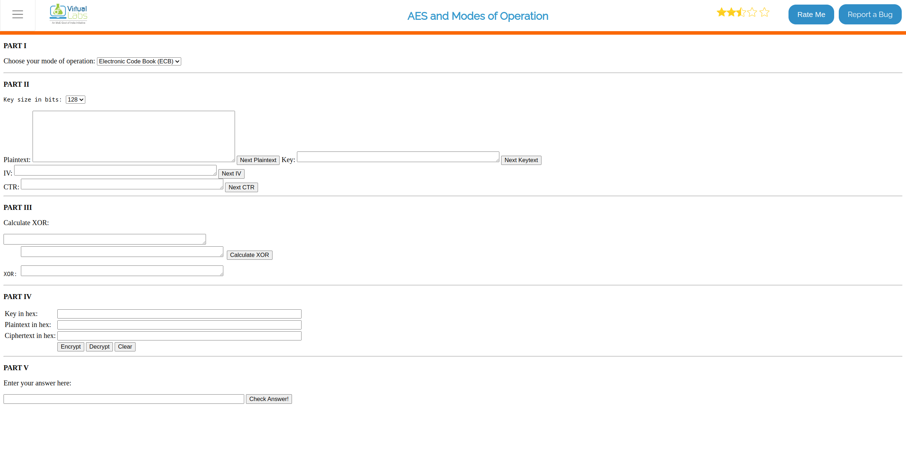
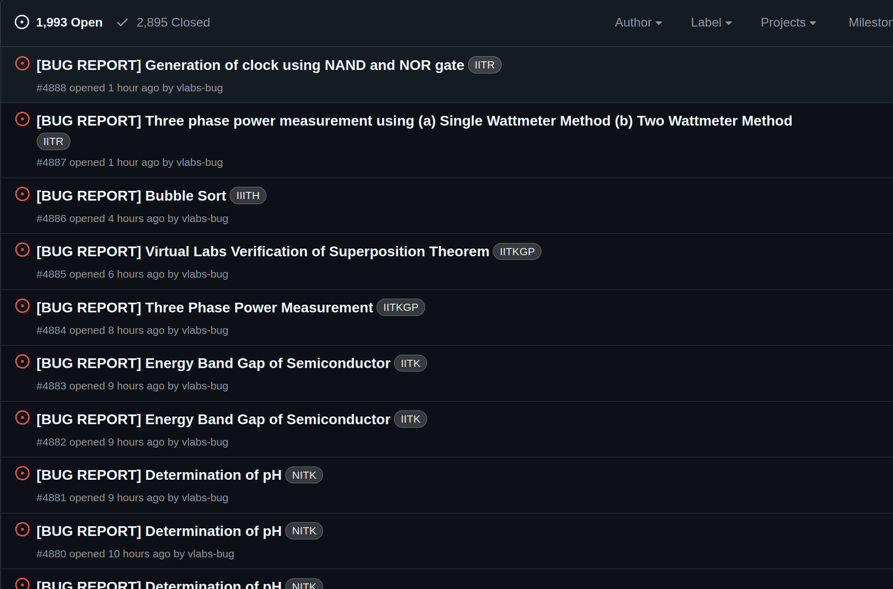
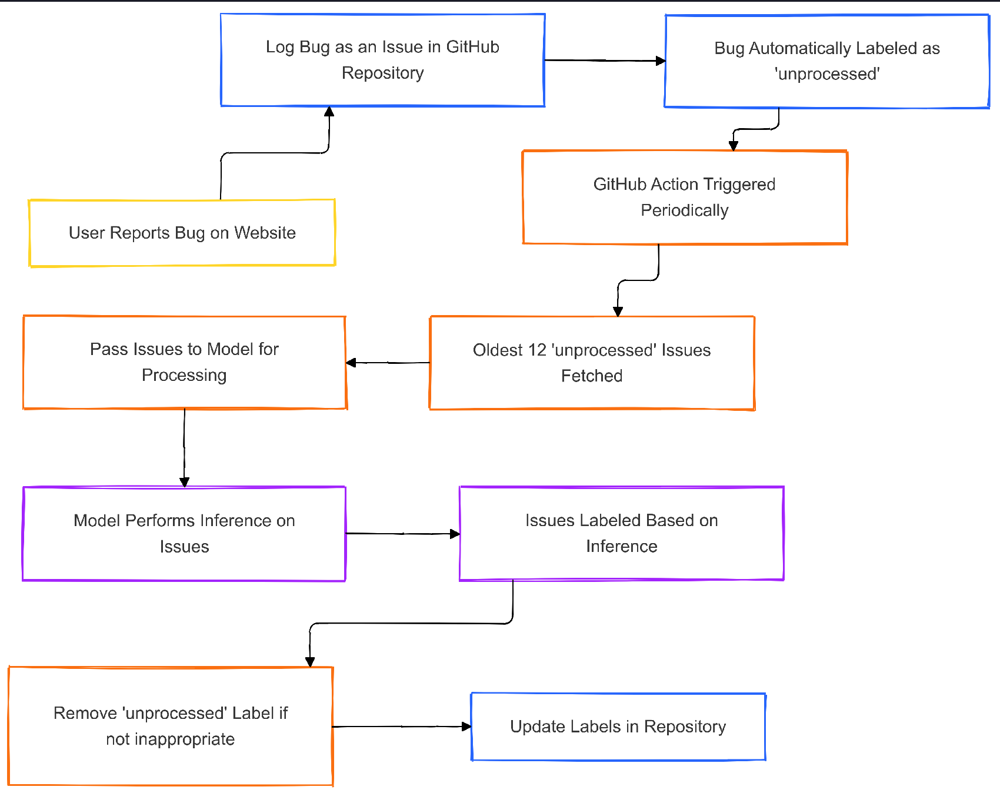
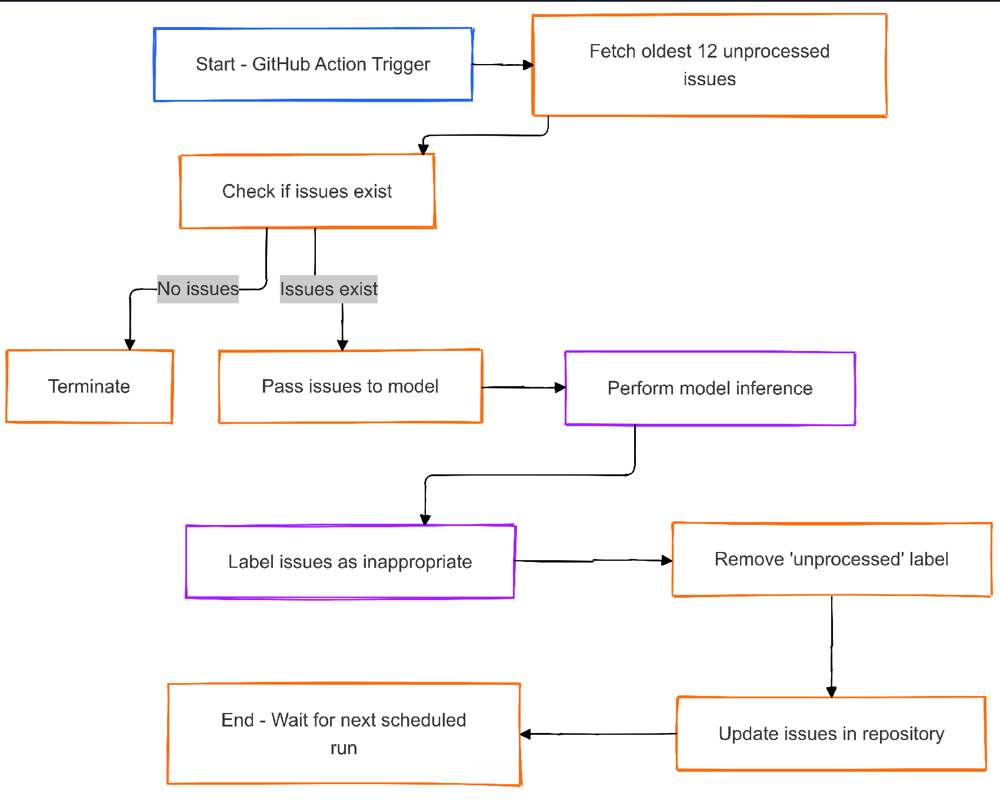

# Inappropriate Bug filtering using Generative AI for the VLabs Bug Logger Tool

## Problem description

The current bug logger tool reports the bugs reported by the users on the experiment pages. This is an automated mechanism where the user response is processed and opened up as a GitHub issue at ```virtual-labs/bugs-virtual-labs```.



In the above image, the 'Report a Bug' feature is used to report bugs.



These bugs are automatically logged as issues in the repository. However, some of these reported bugs aren't appropriate since users have freedom to leave personal comments opening up the opportunity for profanity and vulgar content being logged. This makes it difficult and uncomfortable for developers working on bug resolution to. Current process requires a developer who finds a vulgar/inappropriate issue to label it as "Inappropriate" manually. However, this process is not very efficient as all bugs might not get noticed leading to possibility of inappropriate content creeping up at any time. Also, this process is time taking. 

## Motivation

Large Language Models show promising capabilities to figure out vulgar and profane content in user conversations. This ability can be leveraged to design an automated bug filter which monitors user comments when they are logged as issues and automatically identify if the issue is appropriate or not. For our requirements, we need a model which can identify inappropriate content in not just English but various other Indic languages based on the demographics of our user-base. There exist paid services which specialize on Indic data, however for our use-case, large models such as Gemini which offer free developer APIs can serve the purpose since they have enough training on multiple languages and the task is relatively straightforward. 

## Solution

We decided to create the filter at the repository level, rather than injecting it in the existing control flow. This would ensure stability in integration and less chance of breaking the system. Also, injecting in the original flow could increase latency at the user side since the model inference will be a part of the entire request. 

## Control flow of the entire end-end logic



## Control flow of the filter logic



## Testing the filter

To test the filter, we need 3 important values, True Positives, False Positives and False Negatives. 
- True Positives: How many inappropriate issues was the AI able to correctly predict?
- False Positives: How many regular issues were labelled inappropriate?
- False Negatives: How many inappropriate issues were labelled falsely?

On processing on 2490 issues available from the repository, here are the recorded metrics:
- Total issues processed: 2490
- Predicted Inappropriate (NSFW): 69
- Actual Inappropriate (NSFW): 29
- Correct Predictions: 2424
- Total FP: 53
- Total FN: 13
- Total TP: 16

### Explaining the results:

- **High False Positives**: Roughly 26-27 of the False Positives are actually inappropriate issues which weren't labelled inappropriate since they weren't discovered by any developer. The remaining half of the issues are actual anomalies which makes it crucial that even after relying on the bug filter, the developers need to manually go through the Inappropriate issues sometimes to check for any wrongly flagged issue.

- **Low False Negatives**: This shows promise that most Inappropriate issues get labelled correctly. Also, some of the inappropriate labels weren't actually satisfying the definition of the original 'Inappropriate' issues for which the model was instructed on.

- **True Positive Rate**: The recorded 16 + 26-27 of the unrecorded inappropriate issues indicate that the model has a decent performance in the classification task.


All of these results are available as *json* files.


